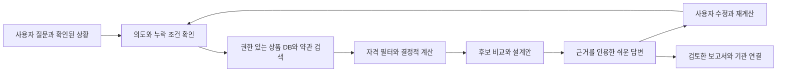

# 3.9.2.3 생활금융 — 상품 탐색·개인화 비교·추천·설계 실행 계획

> 2026-10-03 거래 수정·증권 진단·상품 갱신/복원·상세 시나리오·후속 재계산을 반영한 최신 정본: [구현·검증 현황](V3923_IMPLEMENTATION_STATUS.md). 아래 초기 감사/계획과 실제 구현 완료 범위를 구분한다. 전체 업데이트·배포는 미완료다.

> **2026-10-03 재검증:** 생활금융 확대 방향은 유지하되 이 문서만으로 3.9.2.3 출시 범위/준비를 확정할 수 없다. [수익성 차단 사용자 피드백 재검증](V3923_PROFITABILITY_FEEDBACK_REVIEW.md)의 TRADE23-01~05를 출시 선행 P0로 추가했다. 아래 13절에 데이터 확보 실적·유용성 인수·통합 예산·운영 복구의 보완 요구를 명시한다. 개발/기관 계약 완료를 의미하지 않는다.

> 기준일: 2026-10-02 (Asia/Seoul). 상태: 사용자 요청에 따른 **차기 개발 계획**, 기능 구현·공개 제공 완료 아님. 이번 변경은 Markdown 계획과 문서 연결이며 배포 버전 변경 없음.
> 직접 확인한 소스 표기는 `config/app_version.py`의 후보 3.9.2.2 / 공개 기준 3.9.2.1이다. 3.9.2.3으로 앱·updater·manifest를 올리지 않는다. 설치본·실계정·실제 기관 견적 검증은 별도다.

> **추가 구현:** 지정 상담사/기관 API의 미리보기·동의·접수·철회 연결 준비와 검토 상품 API/RAG 문단·선택 AI 설명을 반영했다. [운영 계약](V3923_FINANCE_CONNECTIONS.md)과 [최신 구현/외부 인수 경계](V3923_IMPLEMENTATION_STATUS.md)를 따른다. 아래 초기 작업표의 미착수 표시는 당시 감사 기록이며 현재 상태는 최신 현황표에서 확인한다.

## 1. 이번 업데이트에서 해결할 문제

사용자가 원하는 것은 금융 용어를 읽고 두 숫자를 직접 입력하는 계산기를 넘어, **잘 모르는 상태에서도 내 상황을 설명하면 필요한 선택지를 찾고, 실제 상품의 차이를 이해하고, 비용·보장·현금흐름을 최적화한 뒤 기관에 확인할 수 있는 서비스**다. 3.9.2.2의 초보자 가이드·로컬 보험 작업공간은 재사용할 기반이지만 이 요구를 충족하지 못한다.

3.9.2.3의 제품 목표는 `상황 파악 → 필요한 질문 → 공식 상품 검색 → 가입조건 확인 → 같은 기준 비교 → 추천 이유·대안 → 설계 수정 → 저장·재검토 → 기관/상담 연결`이다. UI 문구·탭·가상 예시 추가만으로 완료 처리하지 않는다. “모든 기능”은 아래 기능 원장 전체로 관리하며, 지원 상품군/기관/데이터 범위를 명시해 순차 인수한다. 특정 상품군 출시를 전체 금융상품 완성으로 확대하지 않는다.

## 2. 현재 구현 감사: 무엇이 있고 무엇이 없는가

이번 감사는 작업 폴더의 코드·기본 JSON·로컬 메서드 재현이다. 이 폴더에는 `.git`이 없어 branch/commit/diff 기준선을 확인하지 못했다. 사용자 금융 기록·보험 원본은 열지 않았고, 외부 LLM·기관 신청·상담 전송은 실행하지 않았다. 공개 안내는 웹 조회 도구 접근 실패 후 Python 표준 HTTP 클라이언트로 [제품 포털](https://noahai.net/product-status)과 [개발사 사이트](https://noahailabs.com/ko/product/status)의 HTTP 200/HTML 본문을 직접 확인했다. 두 사이트는 생활금융을 정보·시뮬레이션으로, 3.9.2.2 보험을 개발 계획으로 설명하며 실제 상품 전면 비교/개인 견적/상담 접수를 제공 완료로 안내하지 않는다. 이는 공개 HTML 문구 확인이며 브라우저 렌더링·Windows 설치본·기관 연결 E2E 인수는 아니다.

| 확인 지점 | 실제 동작 / 부족한 점 | 3.9.2.3 요구 |
|---|---|---|
| `webui/src/components/LifeFinanceAdvanced.tsx` → `GuidedProductComparison.tsx` | 목적별 가이드, 대출/예적금 두 조건 입력, 보험 자료 작업공간. 상품 검색·후보 발굴·자동 개인화 없음 | 자료 없는 첫 이용자도 목적·상황부터 시작, 기관 상품 탐색과 비교표 연결 |
| `webui/src/financeComparison.ts` | 고정금리·월 단위 대출, 단리 예금·매월 초 적금 계산. 일수/복리/변동/중도해지/우대조건 미지원 | 상품별 계약 계산 규칙과 상환/납입 일정, 가능한 시나리오 비교 |
| `data/finance_products/{loans,insurances,savings}.json` | 이번 조회에서 각각 20개. 기관명·가격이 있어도 공식 출처·약관/공시 버전·판매 유효성·권리 계약이 없는 기본 카탈로그 | 검증된 공급원·상품 버전·옵션·시점·이용권을 갖춘 DB |
| `FinanceProductAdvisor.refresh_if_changed()` | 로컬 JSON mtime 변경 재로드. 금융기관에서 최신 데이터를 받아오는 수집기가 아님 | 공식 공급원 수집·검증·갱신·실패 복구·판매중지 관리 |
| `compare_loans()` | 조건 후보 없음/종류 불일치 시 필터 완화. 잔액 감소와 별개인 단순이자로 총비용 정렬 | 조건 미충족 후보 제거, 계약별 결정적 계산, 없으면 이유/대안 반환 |
| `compare_savings()` | 예금/적금 납입 흐름 구분 부족, 세후계수 0.846 고정, 후보 없으면 전체로 복귀 | 예금/적금·과세·우대조건·한도·중도해지별 계산 |
| `apply_credit_adjustment_to_loans/savings()` | 신용도 라벨로 금리를 임의 ±보정. 예적금에도 적용하며 shallow copy로 nested 결과 변경 | 기관 근거 없는 실제 적용금리 생성 제거, 입력/결과 불변성 보장 |
| `web_platform/advanced_services.py::compare_product()` | 기존 대출/예적금 비교·금리보정 API 경로가 유지됨. 새 React 화면에서 쓰지 않는다고 제거된 것이 아님 | 인증 API·호환 UI·어시스턴트 전체 소비자에서 같은 계약 사용 |
| `trading/life_finance_assistant.py` | 대출 금액 미입력 시 1억/24개월, 예적금 500만원/12개월을 넣는 별도 명령 경로 | 누락 입력 질문, 사용자가 답하기 전 임의 금액·기간으로 추천하지 않음 |
| `application_services.py::ask_assistant()` + `assistant_support_knowledge.py` | 보험/금융상품 키워드는 심층모드도 같은 로컬 안내를 조기 반환. 다른 일반 생활금융 질문은 재무점검 설명으로 흐름 | 사용법/용어/상황 질문/상품 검색/추천/설계/연결 의도 구분 |
| `InsuranceWorkspace` | 암호화 자료·직접 확인·1~2계약 사실 비교·로컬 질문지. 공식 상품 후보·미가입자 탐색·자유 약관 해석·실견적·상담 접수 없음 | 기존 자료 분석과 새 가입 탐색을 각각 지원하고 근거로 연결 |

### 2.1 어시스턴트 질문 재현 결과

`ApplicationServices`를 초기화하지 않고(`object.__new__`) 외부 호출 전에 반환되는 지원 안내 경로만 직접 실행했다. `service=personal_finance`, `explanation_level=beginner`, `mode=deep_analysis`. 아래는 HTTP/Windows E2E가 아닌 **소스 메서드 재현**이다.

| 실제 넣은 질문 | 현재 반환 | 부족한 이유 |
|---|---|---|
| 보험이 하나도 없는데 월 2만원으로 운전자보험 추천해줘 | `insurance_workspace`, Provider 호출 false, 증권 등록·암호화 저장소 안내 | 없는 증권부터 요구하며 운전 상황·예산·신규 가입 선택지를 묻지 않음 |
| 매일 출퇴근하는데 운전자보험에서 변호사비는 어떻게 비교해? | 위 질문과 **답변 SHA-256 동일** | 보장 항목/약관 조건에 대한 질문을 답하지 않음 |
| 월 30만원 적금 중 내 조건에 맞는 상품 찾아줘 | `finance_products`, Provider 호출 false, 금융상품 사용법 안내 | 월납입 상품 검색·우대자격·후보 추천 없음 |
| 목돈 1000만원 1년 예금 추천해줘 | 위 적금 질문과 **답변 SHA-256 동일** | 목돈/월납입이라는 다른 상황이 결과에 반영되지 않음 |
| 대출 비교해줘 | 같은 `finance_products` 안내 | 필요한 금액/용도/기간을 묻는 대화 없음 |
| 급여통장과 카드실적 조건을 못 맞추면 어떻게 달라져? | `support_topic()`은 None | 키워드가 없는 후속 질문에 앞선 상품 맥락을 이어갈 계약 부족. 전체 응답 경로는 미실행 |

추가로 자동 갱신을 끈 `FinanceProductAdvisor`에서 대출 1조원/601개월/존재하지 않는 종류, 예적금 1원/601개월을 각각 입력했을 때도 `best`가 반환됐다. 실제 조건 통과로 해석할 수 없다. 금융상품 안내 hash는 `b4c8a28e97a2d6bf93864c5eb2ad2e1c69f9b36c40d54384f1ec8af02ec13333`, 보험 안내 hash는 `94014d240119560cead2b1e9e9f63e6b7c8f0a53c2abe1f4081f85213d001b33`였다. 합성 입력이며 금융상품 적합성/정확도 인증이 아니다.

**감사 결론:** 질문을 잘 답할지의 우려는 현재 코드에서 재현된다. 외부 모델만 붙이는 것으로는 해결되지 않는다. 상품 데이터·사용자 맥락·질문 라우팅·계산·근거 검색·답변 평가를 함께 바꿔야 한다.

## 3. 공통 사용자 경험과 프로필

첫 화면은 “돈을 빌리고 싶어요 / 보험이 없거나 잘 모르겠어요 / 내 보험을 점검하고 싶어요 / 목돈을 맡기고 싶어요 / 매달 모으고 싶어요”로 시작한다. 상품명을 모르는 이용자도 진행 가능해야 한다. 기존 비교 계산기는 `직접 받은 조건 비교`로 유지하되 기본 탐색의 유일한 경로로 두지 않는다.

1. **최소 질문:** 목적, 금액 또는 월 예산, 원하는 기간/필요 시점, 가장 중요한 기준을 1~3개씩 묻는다. 전문용어 대신 이유와 예시를 제공한다.
2. **상황 확장:** 필요할 때만 소득 안정성·기존 상환·비상자금·보장·연령대·직업·운전 유형·가입자격을 추가 확인한다. 주민번호 전체/계좌 비밀번호를 추천 입력으로 요구하지 않는다.
3. **확인 상태:** `모름`, `아직 확인 안 함`, `해당 없음`, `명시적으로 없음`을 구분한다. 보험 자료 미등록은 보험 미가입이 아니다. 사용자가 미가입이라고 답한 경우에만 신규 탐색으로 이동한다.
4. **결과:** 내 목표, 비교 범위/기관 수/확인 시점, 후보별 적합/조건부/제외 이유, 월 부담·총비용/세후 수령/보장 차이, 다음 확인을 보여준다. 가격이 낮은 이유와 잃는 조건도 함께 설명한다.
5. **수정:** “예산을 줄이면?”, “카드를 새로 만들기 싫어”, “6개월 안에 쓸 돈이야” 같은 후속 질문에서 프로필·조건을 수정하고 재계산한다. 바뀐 항목과 결과 차이를 표시한다.
6. **보존:** 비교 목록·가정·추천 근거·관심 상품·질문·설계 버전을 저장/재열람한다. 상품이나 프로필이 바뀌면 오래된 결과로 표시하고 재평가한다.

가계부·목표·자산통합 정보는 사용자가 선택한 범위로만 연결한다. 기록상 수입/차액을 확인된 소득/잔액으로 승격하지 않는다. 대출 상환·보험료·저축 계획을 같은 현금흐름에서 검토하되 실제 지출을 이중 합산하지 않는다. 가족은 구성원별 권한과 자료 소유를 확인하며 다른 사람의 정보를 자동 공유하지 않는다.

## 4. 대출 비교·추천·설계 기능 원장

| ID | 필수 기능 | 사용자 결과 / 인수 기준 |
|---|---|---|
| LOAN-01 | 신용·주택담보·전세·대환·정책/서민금융·사업자 목적 탐색 | 지원 범위별 질문과 후보; 미지원 상품군은 숨긴 최적 추천 없이 별도 안내 |
| LOAN-02 | 자격·한도·기간·용도·담보/보증·소득/기존 부채 확인 | 충족/미충족/기관심사 필요 분리. 공시 한도는 개인 승인한도와 구분 |
| LOAN-03 | 공시 금리 범위·산정일·고정/변동·기준금리/가산·우대 조건 | 광고 최저/최고/사용자 확인 견적을 구분. 실제 견적 없으면 개인 금리 확정 금지 |
| LOAN-04 | 원리금균등·원금균등·만기일시·거치·일수/반올림 규칙 | 월별 원금/이자/잔액, 초기·최대·평균 부담, 전체 이자와 확인 비용 |
| LOAN-05 | 보증료·인지/설정 등 부대비용·중도상환 비용 | 누락 비용 별도 표시. 총비용 완전성이 다른 후보는 확정 순위로 혼합하지 않음 |
| LOAN-06 | 상환 여력·규정 기반 DSR/LTV 등 참고 계산 | 적용일/차주·상품 예외·필요 입력을 버전 규칙으로 관리. 기관 심사와 구분 |
| LOAN-07 | 금리 상승·소득 감소·조기상환·기간 변경 시나리오 | 사용자 가정별 월 부담과 잔액, 실패 가능 시점. 법정/정책 수치 임의 고정 금지 |
| LOAN-08 | 기존 대출 유지 vs 대환 | 남은 원금/일정·해지/신규 비용·금리변동·손익분기 및 동일 비교기간 |
| LOAN-09 | 설명 가능한 후보/대안·서류 준비 | 왜 해당 후보인지, 제외/조건부 이유, 필요한 서류와 기관 확인 질문 |
| LOAN-10 | 실견적·견적 만료·기관 연결·상환 일정 관리 | 제휴 견적은 재조회/확인 후 연결; 기관 승인·실행 상태와 앱 비교 상태 분리 |

## 5. 보험 비교·추천·설계 기능 원장

### 5.1 보험이 없거나 모르는 사람을 위한 경로

기존 계약 업로드를 필수 단계로 하지 않는다. 먼저 “없음 / 있지만 잘 모름 / 일부만 알고 있음 / 지금 답하기 어려움”을 선택한다. 신규 탐색은 사용 목적·이미 확인한 공적/직장/자동차 관련 보장·감당 가능한 월 예산·걱정하는 상황을 듣고 **보장 필요성 가설과 선택 가능한 유형**부터 설명한다. 예산이 부족하면 우선순위·나중에 검토·가입 보류도 제시한다. 가입 자체를 성공 기준으로 두지 않는다.

| ID | 필수 기능 | 사용자 결과 / 인수 기준 |
|---|---|---|
| INS23-01 | 미가입/정보불명/기존 가입의 별도 시작점 | 자료 없는 이용자도 설명·요구 보장·후보 탐색·질문지까지 진행 |
| INS23-02 | 실손·건강/암·상해·운전자·자동차·정기/종신·여행/주택·연금/저축성 유형 안내 | 보장 목적·기간·환급/저축과 위험보장의 차이. 유형별 실제 지원 기관/상품 범위 별도 공개 |
| INS23-03 | 개인 상황·예산·기존 보장·공백/중복 가능성 점검 | 불필요한 특약·지급방식·유지 선택까지 검토, 건강/인수 정보는 별도 권한 |
| INS23-04 | 상품/특약/가입 시점별 약관 근거 DB | 보장명·지급 사건·한도·자기부담·면책/감액·갱신·제외·인수조건·근거 문단 |
| INS23-05 | 공식 상품 후보와 개인별 확인 견적 | 대표 보험료와 실제 연령/직업/보장 조합 견적 구분. 견적 없는 경우 월 보험료 추정 생성 금지 |
| INS23-06 | 기존 자료 추출·원문 대조·정정 고도화 | 기존 vault 재사용. OCR/표 추출은 권한 있는 정답셋·사용자 확인·오류/보류 인수 후 활성화 |
| INS23-07 | 같은 보장/조건 비교와 보장 공백 설명 | 항목별 가격·지급조건·비교 불가능 이유. 단일 보장 점수로 승자 결정 금지 |
| INS23-08 | 최소 부담/균형/보장 우선 설계 초안 | 예산·목적별 선택안, 필수/선택 특약 근거·누락·트레이드오프. 가능한 조합/인수 여부 확인 |
| INS23-09 | 유지/조정/추가/교체 시나리오 | 보험료·환급 손실·새 면책·보장 축소·재심사·갱신 비용 불확실성 |
| INS23-10 | 전문가 검토·견적 요청·상담 연결·가입 후 점검 | 보고서/질문지/동의와 수신 기관, 접수/수정/철회·갱신/만기 관리 |

### 5.2 운전자보험: 필수 수직 검증 시나리오

“보험이 없어요. 출퇴근 운전을 하고 월 2만원 안에서 알아보고 싶어요”를 첫 통합 과제로 둔다. 아래는 **개발 시나리오이며 특정 개인에 대한 실제 가입 권유가 아니다.**

- 운전자보험·자동차보험의 목적과 보장 차이를 쉽게 설명한다. 자가용/영업용 등 운전 용도와 기존 자동차보험 특약에서 확인할 보장을 질문한다. 모든 보장이 없다고 추정하지 않는다.
- 운전자 벌금, 교통사고처리지원금, 변호사선임비용 등을 상품의 정확한 특약/약관 버전에 연결해 비교한다. 지급 사건·수사/재판 단계·한도/횟수·자기부담·제외 사유·실손/정액·다른 계약과의 관계를 표로 보여준다.
- “변호사비가 얼마까지 나오나요?”에는 가입금액을 확정 지급액처럼 답하지 않고 해당 약관의 사건 조건·산식·근거를 제시한다. 상품/가입 시점에 따라 다른 자기부담 비율을 모든 상품에 고정하지 않는다.
- 예산 안의 검증된 후보가 있으면 보장 차이·필요/선택 특약·인수 미확정을 설명한다. 대표 조건만 있는 경우 “공시 조건 비교”로 두고 개인 보험료는 기관 견적을 요청한다.
- 후보가 없으면 월 보험료를 낮게 만들어 넣지 않는다. 검색 범위·미확인 조건·예산 변경/보장 재검토/기관 확인 선택지를 제시한다.
- 기존 계약이 있는 후속 시나리오에서는 새 약관이 무조건 좋다고 하지 않고 유지안도 비교한다. 비교 결과와 질문지는 사용자가 검토 후 상담에 가져갈 수 있어야 한다.

## 6. 예금·적금 비교·추천·설계 기능 원장

| ID | 필수 기능 | 사용자 결과 / 인수 기준 |
|---|---|---|
| SAVE-01 | 목돈 예금/정기·자유 적금/단기 유동성/정책상품 목적 탐색 | 지금 가진 돈과 미래 납입액·필요 시점·비상자금 구분 |
| SAVE-02 | 기본/최고/실제 충족 우대금리 | 급여·카드·신규·거래·연령 등 조건별 충족/불명·추가 비용. 최고금리만 정렬 금지 |
| SAVE-03 | 가입금액·월납입 상한·기간·가입 채널·판매한도·자격 | 조건 미충족 상품 제외/조건부 이유, 품절/판매중지 표시 |
| SAVE-04 | 정기/자유 납입·단리/복리·일수·반올림·과세 | 납입 일정별 원금·세전/세후·만기 수령, 실제 적용 과세 확인 |
| SAVE-05 | 중도해지/부분인출/납입 누락·지연·우대 상실 | 필요한 시점의 수령액과 수익 감소, 계산 규칙 불명은 확정하지 않음 |
| SAVE-06 | 예금 보호·기관별 합산·보호/비보호 상품 구분 | 시행일 있는 공식 규칙과 확인된 동일 기관 보유액; 보유액 모르면 전체 보호 확정 금지 |
| SAVE-07 | 목표별 만기 분산·비상자금·월 납입 설계 | 동일 현금흐름 조건에서 예금/적금/분산안 비교, 미래 월납입은 현금 자산으로 합산 금지 |
| SAVE-08 | 정책 우대상품 자격·납입/혜택 한도 | 공식 시행일·자격·중복 제한/혜택 미확인 상태. 수혜를 확정하지 않음 |
| SAVE-09 | 상품 검색·관심 목록·만기/금리 변경 알림 | 정렬 기준 변경·후보 저장·시점 표시·알림 동의·재추천 |
| SAVE-10 | 기관 상품 상세/가입 채널 연결·준비 서류 | 공식 URL/기관·상품 버전 대조, 링크 열기와 실제 가입 접수 구분 |

## 7. 상품 데이터베이스와 최신화 설계

### 7.1 데이터 계층과 저장 위치

공개 상품 DB를 공용 데이터 서비스에서 갱신하고, PC는 schema·해시와 신뢰한 공급자 키의 서명을 확인한 읽기 전용 캐시를 사용한다. 해시만으로 공급자 진위를 인증하지 않는다. 개인 프로필·보험 자료·실견적·상담 기록은 공용 상품 DB와 분리한다. 중앙 DB는 기존 서비스 운영 환경과 접속권한 확인 후 선택하며 이 문서로 생산 DB 변경/마이그레이션을 실행하지 않는다. PC 캐시는 SQLite 등 인덱스 가능한 저장소를 검토하고 기존 JSON은 **교육용 예시**로 격리한다.

| 객체 | 최소 필드 / 관계 |
|---|---|
| `provider`, `source_contract` | 기관 ID·유형·공식 도메인, 공급원·권리 범위·수집/보관/재배포·상업 이용·갱신 계약 |
| `product`, `product_version` | 공급원 상품 ID·기관·유형, 판매상태/기간, 공시/약관 적용기간, 원문 hash/URL, 수집/검증/유효 시각 |
| `loan_option`, `saving_option` | 금액·기간·상환/납입·금리/이자·우대 규칙·자격·비용/과세·해지·규칙 버전 |
| `insurance_rider`, `coverage_rule` | 특약·조합 가능성·지급 사건/단계·한도·자기부담·면책/제외·갱신·가입 시점 |
| `evidence_chunk` | 원문/버전/쪽/조항/범위·정규화 필드 연결·검색 인덱스, 권리/민감도 |
| `ingestion_run`, `quality_issue` | job ID·전체/증분·시작/완료·공급원 응답·페이지 수·오류/검증·격리·재시도·승인자 |
| `profile_version`, `quote` | 계정별 확인값·미확인/이유·동의 범위, 기관 견적 ID·적용 조건·발급/만료·인수 미확정 |
| `comparison_session`, `design_version` | 질문/목표·확인값·후보/제외·계산/규칙·근거·제안과 선택·변경 이력 |
| `handoff`, `consent_receipt` | 대상/목적·선택 필드·동의 버전·전송 hash·idempotency key·접수 ID·상태/철회 |

핵심 값에는 `value + unit + status + evidence_id + applicable_at`을 둔다. 미확인은 null+사유이며 수치 0과 구분한다. 공시 금리·대표 보험료·개인 실견적을 서로 덮어쓰지 않는다. 기관/상품/옵션/버전 키로 중복 제거하며 이름 유사도만으로 통합하지 않는다. 판매중지와 과거 계약 약관 보존은 별도다.

### 7.2 수집·갱신·운영

`공급원 수집 → 원문 보존/권리 확인 → 정규화 → 단위·범위·참조·변경 검증 → 오류 격리 → 검토 → 원자적 게시 → 캐시/검색 갱신 → 영향받은 비교 무효화·알림`을 실행한다. 다중 페이지 일부 성공을 전체 최신화 성공으로 표시하지 않는다.

- 초기 운영 목표는 공시 목록 매일 확인·약관 변경 감지·견적 사용 직전 유효성 확인이다. **실제 주기/허용 노후시간은 공급원별 계약·변경 빈도로 확정**한다. 매일 job이 실행됐다는 이유로 상품을 실시간이라고 표시하지 않는다.
- `source_as_of`, `collected_at`, `verified_at`, `expires_at`, `last_success_at`, `last_attempt_at`를 구분한다. 오래된 자료는 노후 표시·추천 제외/기관 재확인으로 처리한다. 실패한 수집시각으로 최종 성공시각을 갱신하지 않는다.
- 장애·rate limit·권한 만료·schema 변경·상품 삭제/판매중지·원문 상충을 감지한다. 지수 backoff·중복 방지·마지막 정상본·롤백·관리자 경보·수동 정정 이력을 제공한다. 상충 자료를 몰래 혼합하지 않는다.
- 운영 콘솔에 유형/기관/상품 수, 판매중/종료, 권리/근거/핵심 필드 완전성, 노후율·수집 지연·오류/변경 큐·재처리·활성 공급원을 표시한다. 견적 비용·API 한도·운영 책임/담당자를 확정한다.
- 검색 결과에 **지원 기관/유형·조회 범위·탈락/미확인·시점**을 공개한다. 지원 유형의 비교 인수는 이용권 있는 서로 다른 기관의 후보를 동일 기준으로 대조해야 한다. 기관 수에 관한 실제 적용 요건은 별도 검토하며 한 기관만 조회해 시장 최적이라고 하지 않는다.
- 공식 열람 링크만 확보한 상태는 DB 이용권/수집 완성으로 처리하지 않는다. 조건 미충족 시 해당 공급원을 비활성 상태로 두고 권리 있는 자료·사용자가 입력한 견적 비교로 진행한다.

### 7.3 외부 근거와 미확인 계약

2026-10-02 웹 조회에서 아래 공식/공공 발표를 확인했다. 데이터 이용권·API 명세·NoahAI 제휴나 등록 확보의 증거는 아니다.

- 금융상품 한눈에는 공식 공시 후보 공급원이다. [금감원 발표를 게시한 강원도 소비생활센터](https://consumer.gwd.go.kr/board_news/58806)를 참고했다. **금감원 원 사이트/API 상세는 이번 도구로 접근하지 못했다.** API 키·현행 endpoint/필드·상품 유형별 완전성·호출 한도·이용 약관 확인을 DATA-01의 선행 업무로 둔다. OPENDART 회사 공시 API를 금융상품 개인 견적 API로 사용하지 않는다.
- [금융위의 보험다모아 설명](https://fsc.go.kr/po010104/73716)은 보험 비교정보/보험사 이동 경로의 참고다. 전체 보험 API·운전자보험 견적·재배포권이 NoahAI에 제공된다는 뜻이 아니다. 보험사 공시실/약관·권리 있는 견적 계약을 개별 확보한다.
- [금융위 2026-09-28 예금 중개 제도 개선 규정변경예고](https://fsc.go.kr/po010101/87787)는 **예고 단계**로 확인됐다. 예고 내용을 이미 시행된 등록/중개 권한으로 해석하지 않는다. 실제 추천·중개·연결 방식의 적용 요건/시행일을 활성화 전에 재확인한다.
- [롯데손해보험 운전자보험(2604) 공식 약관](https://www.lotteins.co.kr/upload/C/let_drive_relax_2604_yak.pdf), [AXA 운전자보험 공식 약관](https://www.axa.co.kr/AsianPlatformInternet/doc/internet/public/direct_driver_provision2506.pdf)은 변호사선임비용·다른 계약·지급조건을 **상품 버전별로** 읽어야 하는 데이터 구조 참고다. 현재 판매 중 여부·개인 보험료·최적 후보는 검증하지 않았다. 공개 문서를 전체 모델 학습/배포할 권리는 별도 확인한다.

## 8. AI 어시스턴트: 질문에 답하고 비교와 설계를 수행하는 구조

### 8.1 경로와 도구

현재의 넓은 보험/예금 키워드 조기 반환을 `사용법/장애 안내`에 한정한다. 개인금융 질문은 intent + 현재 대화/비교 세션을 기준으로 `용어 설명`, `최초 상황 상담`, `상품 탐색`, `조건/약관 질문`, `추천/설계`, `시나리오 변경`, `상담 준비`에 연결한다. 문장에 상품명/키워드가 없어도 “그것보다 싼 건?”, “조건을 못 맞추면?”을 세션에 연결하고, 대상이 불명확하면 확인한다.

- 도구 계약: `profile_missing_fields`, `search_products`, `check_eligibility`, `fetch_evidence`, `calculate_cashflows`, `compare_options`, `build_design`, `prepare_handoff`. 요청/응답 schema·권한·누락·시점·오류·타임아웃을 관리한다. 모델이 숫자·자격·견적·상품을 생성해 도구 결과로 가장하지 못하게 한다.
- 계산·필터·세금/보호/심사 참고 규칙은 버전 코드/데이터가 담당한다. LLM은 질문·근거 요약·차이 설명·설계 대화를 맡고, 확인된 결과에서만 서술한다. 검색(RAG)은 공식/권리 있는 원문 버전과 구조 DB를 같이 조회한다.
- 설명 결과는 `지금 답 → 내 조건/부족 입력 → 후보/차이 → 추천 이유와 포기하는 조건 → 근거/시점 → 다음 행동`이다. 모든 대답에 긴 사용법·거래소 오류 안내를 반복하지 않는다.
- 추천은 먼저 자격/예산/기간 등의 hard constraint를 적용하고 비용·유동성·보장 목표별 대안을 만든다. 목적별 추천 이유·불확실성·제외 후보를 공개한다. 임의 단일 점수/수수료/인기순으로 최적이라고 하지 않는다. 후보 없음은 정상 결과이며 질문/다른 조건을 안내한다.
- 외부 LLM은 일반 공개 상품 질의와 개인 자료 해석을 분리한다. 개인 정보/보험 문맥은 전송 항목·수신 Provider·목적·보관/비용을 확인한 선택 범위만 사용한다. 미동의일 때도 로컬 용어·규칙 기반 질문/계산/사용자 입력 비교가 동작해야 한다. 현재 보험 미전송 보호를 단순 삭제하지 않는다.
- 답변/제안은 프로필/상품/견적/규칙/검색/모델 버전과 연결하고 재현 가능하게 남긴다. 민감 원문을 일반 로그에 넣지 않는다. timeout/비용 한도/Provider 불가 시 부분 근거·불가 이유·재시도/로컬 대안을 표시한다.

### 8.2 데이터 갱신과 모델 학습의 역할

**금리·보험료·약관 최신화는 DB/원문 검색이 담당한다.** LLM을 학습시켜 최신 상품을 암기하게 하는 것을 기본 방법으로 삼지 않는다. 모델 변경 없이 상품 데이터 갱신만으로 새 근거가 반영되어야 한다.

추가 학습은 질문 의도·용어 매핑·쉬운 설명 품질 개선에 필요한 경우에만 별도 실험한다. 권리/동의 있는 평가·학습 자료, train/test 분리, 삭제/철회 반영, 회귀·전문가 평가와 비용효과를 통과해야 한다. 고객 보험 원본·건강정보·상담 내용을 공용 학습셋으로 자동 편입하지 않는다. 선택/만족도는 추천 검증 자료이며 가입 전환율을 최적화 보상으로 쓰지 않는다.

## 9. 상담사·설계사·금융기관 연결과 사후 관리

사용자에게 끊기지 않는 다음 행동을 제공해야 한다. 제휴가 없다고 모든 기능을 자료 등록 안내로 되돌리지 않는다.

| 단계 | 사용자가 받는 것 | 활성화 조건 / 상태 의미 |
|---|---|---|
| 공식 기관 이동 | 검증된 상품 상세/기관 도메인·준비사항·내 비교보고서 | 링크/판매상태/버전 검사. 외부 화면 열림은 상담/가입 접수 아님 |
| 상담 준비 | 요구사항·예산·후보/차이·근거·미확인·질문지·공유 미리보기 | 저장/출력/마스킹 선택. 기존 TXT도 재사용하며 원문 자동 전송 없음 |
| 제휴 견적/상담 요청 | 대상 기관/등록된 역할·전송 항목·목적·동의·연락방법 | 데이터/사업/보안/적용 요건 확인 후 명시 전송. 자동 전체 공유 금지 |
| 접수/후속 관리 | `prepared → consented → submitting → received → in_consultation → closed` | 접수 ID 있는 received만 접수 완료. timeout은 상태 조회 후 재시도; 중복 접수 방지 |
| 수정/철회/민원 | 전송 내역·연락 중단·철회/삭제 요청 및 결과·문의 경로 | 앱 동의 철회와 기관 보유자료 삭제 완료 구분. 실패/대기/취소 별도 상태 |
| 사후 점검 | 확인된 선택/견적·계약/납입·만기/갱신 알림·재비교 | 사용자가 실제 체결을 확인하기 전 가입 완료로 표시하지 않음 |

은행/저축은행·보험사/적법한 상담/설계 주체별 책임·상품 범위·응답 SLA·민원·동의/보관·수수료·실패/정산을 계약으로 확정한다. 유료/제휴 표시와 추천 엔진을 분리한다. 법적 요건은 실제 사용자 흐름을 검토해 정하며 단순 링크/보고서라는 이름만으로 면제라고 선언하지 않는다. 외부 연락/협상은 이번 문서 작업에 포함하지 않는다.

## 10. 3.9.2.3 실행 순서·책임·완료 증거

아래 역할은 필요한 책임이며 실명 담당자 배정은 미완료다. 데이터/도메인/운영/사업 책임자와 인수자를 착수 때 지정한다. D0/D1은 착수/다음 작업 묶음이지 하루 만에 기관 계약·전체 기능을 완성한다는 약속이 아니다. 외부 의존·48시간 초과 작업은 후속 스프린트로 관리하되 3.9.2.3 목표 원장에서 지우지 않는다.

| 작업 ID | 순서 / 산출물 | 의존성·역할 | 완료 증거 / 현재 상태 |
|---|---|---|---|
| AUDIT-23 | 현재 기능·질문/필터 재현·차기 요구 원장 | 제품/개발 | 이번 문서와 직접 소스 재현 완료; 공개 설치본 미검증 |
| LF23-01 | D0: 사용자 여정·프로필/상태·지원 상품군/기관 원장 | 제품·UX·도메인 | 미가입/모름·목돈/월납입·대환 여정 승인 / 미착수 |
| LF23-02 | D0: 기존 추천/기본값/필터 완화/신용금리 보정 제거 계획 구현 | 개발·QA | 모든 API/UI/assistant 소비자 목록·회귀 / 미착수 |
| DATA-01 | D0: 공급원·API 현행 명세/권리·운영/비용·기관 범위 확인 | 데이터·사업·법무 | 유형별 확보/대기/미지원 원장 / 미착수 |
| DATA-02 | D1: 버전 DB/계정 격리·읽기 캐시·migration/rollback | LF23-01, DATA-01·개발 | schema/권한/호환/원자성 시험 / 미착수 |
| DATA-03 | 후속: 수집·정규화·검증·관리 콘솔·변경/노후/판매중지 | DATA-02·데이터/운영 | 권리 있는 공식 데이터 재수집·장애복구 / 미착수 |
| AI23-01 | D1: 의도·프로필 질문·대화 세션·tool 계약 | LF23-01·AI/개발 | 서로 다른 질문의 해당 답·후속 맥락 유지 / 미착수 |
| CALC-23 | D1~후속: 공통 계약 계산·규칙 버전·비교 완전성 | DATA-02·개발/도메인 | 기관 예시·독립 계산 정답과 금액/일정 대조 / 미착수 |
| LOAN-23 | 후속: LOAN-01~10 사용자 흐름 | DATA-03, CALC-23·대출 검토/개발 | 조건/상환/대환/공시 vs 실견적 인수 / 미착수 |
| INSURANCE-23 | 후속: INS23-01~10, 운전자보험 수직 흐름 우선 | 기존 vault, DATA-03·보험 검토/개발 | 미가입 추천 준비·약관/보장 비교·설계·유지 대안 / 미착수 |
| SAVING-23 | 후속: SAVE-01~10 사용자 흐름 | DATA-03, CALC-23·예적금 검토/개발 | 우대/세후/납입/유동성·만기 분산 인수 / 미착수 |
| AI23-02 | 후속: RAG/개인화 대안·근거 답변·외부 AI 동의 | AI23-01, 도메인별 엔진·AI/보안 | 사실·근거·시점·누락·프로필 반영 평가 / 미착수 |
| UX23-01 | 후속: 검색/비교표·설계 수정·저장·접근성 | 각 엔진·UX/개발 | 실제 React→API→DB 저장/재열람·초보자 과제 / 미착수 |
| LINK-01 | 후속: 공식 URL·보고서/질문지·기관별 준비 안내 | DATA-01/03, UX23-01·개발 | 유효 링크·범위/전송 미실행 표시·내보내기 / 미착수 |
| LINK-02 | 후속/기관 조건: 실견적·상담 수신·동의/접수/철회 | 계약·적용 요건·LINK-01·사업/웹/보안 | 동의된 제휴 환경의 실제 접수·중복/철회 대조 / 조건 미확보 |
| OPS-23 | 후속: 변경/만기 알림·장애운영·코스트·삭제/백업 | DATA-03, UX23-01·운영/보안 | stale/오프라인/종료상품/복원·알림 동의 / 미착수 |
| EVAL-23 | 전 단계 병행: 정답셋·의도/추천/설계·도메인 인수 | 권리 있는 자료·도메인/QA | 아래 매트릭스의 지원범위별 성적 / 미착수 |
| RELEASE-23 | 마지막: 전체 연결·Windows·성능·문서/공개 설명 | 각 필수 작업·릴리스/QA | 설치본·업그레이드/롤백·버전/commit/artifact 일치 / 미착수 |

LF23-02의 안전 교정은 데이터 계약 대기와 무관하게 먼저 가능하다. 개인정보를 보내지 않는 로컬 질문/계산·프로필 확인도 독립 진행한다. 공식 데이터/개인 추천을 제공 완료로 표시하는 시점은 권리·도메인·기술 인수 후이며, 상담 실접수는 별도 기관 조건을 충족해야 한다.

## 11. 검증 매트릭스와 출시 판정

| 평가 영역 | 반드시 포함할 사례 | 통과 판단 |
|---|---|---|
| 상황/대화 | 미가입/모름/일부 보험, 월납입/목돈, 무입력, 예산·기간 변경, 키워드 없는 후속 질문 | 사용자 조건과 결과가 연결되고 불명값을 질문; 동일 사용법 반복으로 완료 금지 |
| 공급원/DB | 전체/증분·부분 페이지 실패·위조/손상 캐시·schema 변경·노후·판매중지·상충·재시도·롤백 | 시점/완전성/이용권/현재 판매상태가 맞고 stale 데이터를 확정 추천하지 않음 |
| 대출 | 자격불일치/후보없음, 상환법/거치·금리변동·비용불명·대환·0금리·한도 밖 | 필터 우회·가짜 금리/한도/승인 0; 독립 정답과 계약별 반올림 허용오차 대조 |
| 보험 | 미가입 운전자, 가입시점/특약/수사단계·자기부담·실손/정액·중복·면책·유지/교체 | 지급/보험료/인수 확정 환각 0; 중요 조건의 근거·보류를 검토자가 인수 |
| 예적금 | 우대 미충족/불명·한도·납입시점/누락·복리·과세·중도해지·보호 합산 | 실제 충족 조건 수익 계산; 신용도로 예금금리 보정 0; 불명액을 0 처리 0 |
| AI 답변 | 현재 감사 질문+뜻이 다른 변형·다중턴·상품 특정 질문·근거 부재·공격 문서 | 질문에 답함·정확도·근거/상품 버전 일치·이해도·적절한 추가 질문을 각각 채점 |
| 추천/설계 | 가격 vs 보장/유동성, 비제휴 후보·유지/보류안·예산상충·미확인 비용 | hard constraint 위반 0; 추천 이유/대안/상충/지원 범위 확인; 전문가 비교 평가 |
| 저장/권한 | 세션 재개·프로필/상품 수정·잠금·계정전환·동의취소·삭제·backup/upgrade | 다른 계정/미동의 외부 전송 0; 오래된 결과 무효화·원문/민감로그 노출 0 |
| 기관 연결 | 링크 vs 접수, timeout/중복·만료견적·재시도·수신자변경·철회/삭제 | 기관 접수 ID 대조·동의 필드 일치·중복 0, 실제 수신 증거 없이 접수 완료 금지 |
| UX/운영/Windows | 초보자·키보드/스크린리더·창폭/DPI·장시간·오프라인·동시 거래 부하 | 핵심 과제 완수/오해/이탈 측정, 3.9.2.2 대비 성능·설치/보존/롤백 인수 |

평가셋 초안은 세 영역별 최소 30개(총 90개)의 질문/도메인 사례와 각 영역 10개 이상의 다중턴 여정으로 시작한다. 이는 목표 커버리지이며 아직 데이터셋을 만들거나 통과한 수가 아니다. 독립 도메인 검토자가 정답/필수 질문/허용 보류를 정하고, 학습셋과 분리한다. 변경된 데이터·규칙·검색·모델마다 재평가한다. 안전 위반 0만으로 유용성 합격으로 보지 않으며 질문별 답변 적절성·근거 정확도·초보자 과제 기준은 인수 전에 정한다.

### 11.1 완료 체크리스트

- [x] 소스/기본 카탈로그·어시스턴트 동일 안내·필터 우회 재현 및 요구사항 문서화.
- [ ] 세 영역에 상황 입력→권리 있는 실제 상품 탐색→조건 비교→근거 추천/설계→수정→저장/재열람이 연결됨.
- [ ] 보험이 없는 이용자의 운전자보험 여정과 예금/적금 납입 목적 구분을 실제 화면/API로 통과.
- [ ] 모든 소비자에서 샘플 실제추천·임의 신용금리·기본 금액 삽입·후보 필터 우회를 교정함.
- [ ] 공식 데이터 권리/범위·상품/약관 버전·갱신/노후/판매중지·장애 운영 인수.
- [ ] 질문별/다중턴 답변·계산/약관 정답셋·개인화 비교/설계를 도메인 검토자가 인수.
- [ ] 공식 기관 이동·상담 준비 흐름을 통과, 제휴 실접수는 실제 동의/수신/중복/철회 증거까지 통과.
- [ ] 개인정보·비용·접근성·성능·Windows 설치/upgrade/rollback 및 기존 투자/가계부 보존 인수.
- [ ] CHANGELOG/사용법/인앱 메뉴얼/FAQ/제품 포털의 현행·미지원·계획 범위 동기화 후 배포 자산 확인.

### 11.2 범위 변경 규칙

3.9.2.3의 세 영역별 필수 원장은 위 LOAN/INS23/SAVE 전체다. 제휴 실접수·기관 실견적은 외부 조건이 필요한 작업으로 명시하지만 개발 필요성을 계획에서 삭제하지 않는다. 외부 조건이 확보되지 않을 경우 해당 기능은 `미지원/준비 중`으로 유지하고 **데이터·개인화 추천/설계·연결 전체 완료로 발표하지 않는다**. 출시 범위를 줄여야 할 때는 남은 ID·이유·사용자 영향·후속 범위를 사용자에게 제시한다. 가이드/계산기만 다시 제공하고 이 요구를 완료로 바꾸지 않는다.

## 12. 문서 연결과 다음 착수점

- 이 문서: **3.9.2.3 제품 요구·현황 감사·DB/AI/상담 구조·기능/작업/인수 원장의 정본**.
- [UPDATE_PLAN](UPDATE_PLAN.md#v3923-life-finance): 차기 개발 우선순위와 진행 상태.
- [생활금융 로드맵](LIFE_FINANCE_ROADMAP_20260428.md): 단계/선행 버전과 연결.
- [기존 상품 비교·보험 정본](LIFE_FINANCE_PRODUCT_COMPARISON_ANALYSIS_20260429.md#v3922-insurance-plan): 3.9.2.2 구현/인수 경계를 보존.
- [ARCHITECTURE](ARCHITECTURE.md), [AI_ASSISTANT_GUIDE](AI_ASSISTANT_GUIDE.md): 목표 시스템/질문 경로와 현재 경로를 구분.
- [TEST_STATUS](TEST_STATUS.md), [DEPLOY_CHECKLIST](DEPLOY_CHECKLIST.md): 이번 감사 범위 및 후속 인수/배포 증거.
- [LIFE_FINANCE_GUIDE](LIFE_FINANCE_GUIDE.md), [문서 인덱스](README.md): 사용자가 현재 기능과 차기 요구를 찾아가는 진입점.

다음 착수점은 **TRADE23-01~05 출시 선행 진단/교정**과 LF23-01/02 + DATA-01 + AI23-01이다. 생활금융은 사용자 상황/질문 계약과 기존 잘못된 추천 경로를 먼저 정리하고, 세 상품군의 실제 데이터 확보·갱신과 계산/설계를 연결한다. 현재 부족함을 문구로 덮지 않고 사용자가 과제를 완수하는지를 기준으로 개발한다.

## 13. 2026-10-03 재검증: 빠졌거나 구체화가 필요한 항목

### 13.1 버전 전체의 우선순위

이전 계획은 생활금융의 기능 목록은 넓게 다뤘지만 **현재 고객의 거래 정지 피드백, 실제 데이터 확보 여부, 구현 가능한 첫 지원 범위와 검증 책임**을 출시 판단으로 충분히 묶지 못했다. 30개 기능 ID 등록은 기능 완성의 증거가 아니다. 순서는 다음과 같다.

1. **P0: 기존 거래 신뢰성.** TRADE23 정책 상속·표본/시간순·Hard stop/데이터 불명·진단/복구·보유 보호 인수. 임계값을 낮춰 체결을 만드는 것은 해결이 아니다. 고객 원인이 미확정이면 그 상태와 영향·대응 경로를 그대로 기록한다.
2. **P1: 생활금융의 실제 사용자 과제 완수.** 세 영역에서 확인된 지원 유형/기관 자료로 상황 질문→탐색→계산/보장 비교→이유가 있는 대안→설계 수정→저장/기관 확인 흐름을 통과한다. 샘플이나 고정 사용법만으로 완료하지 않는다.
3. **외부 의존 항목: 실견적·전송/접수·상업 연계.** API/권리/도메인/사업 조건 확보 상태를 관리하고 계약 완료 뒤 실제 접수까지 검증한다. 미확보 항목을 완료하거나 원장에서 삭제하지 않는다. 외부 조건 때문에 출시 범위를 조정해야 한다면 잔여 ID·사용자 영향·후속 조건을 제시한다.

P0 해결만으로 생활금융 요청을 충족했다고 할 수 없고, 생활금융 화면 완성만으로 P0를 통과했다고 할 수 없다. 투자 서비스와 금융상품 서비스의 데이터·계산·실행 권한은 분리하되 진단/출시 증거 기준은 함께 적용한다.

### 13.2 실제 데이터·첫 지원 범위의 확정 원장 (DATA-01 보강)

현재 문서는 **실제 사용권/API 키·정규화 가능한 응답·개인 견적 계약·검토 담당자 확보 증거를 제시하지 못한다.** 다음 표를 채우기 전 세 분야 전체 실상품 서비스가 바로 구현 가능하다고 추정하지 않는다.

| 영역 | 첫 검증 과제 | 확보해야 할 실제 근거 | 이번 확인 상태 |
|---|---|---|---|
| 대출 | 신규 신용대출 조건 비교 및 기존 대출 유지/대환 비교 | 기관별 실제 공시/견적, 적용일·범위·비용·상환 규칙·권리 | 계획만 등록, 기관 데이터 인수 미완료 |
| 보험 | 미가입자의 운전자보험 탐색 및 기존 계약 유지/추가 비교 | 서로 다른 기관의 정확한 상품/특약 버전·판매상태·약관·견적 조건·보험 검토자 | 약관 구조 참고와 기능 요구만 확보, 서비스용 카탈로그/견적 미확보 |
| 예적금 | 목돈 예금·월 적금, 우대 미충족/중도해지 조건 비교 | 기관별 실제 기본/우대·납입한도·해지/과세 규칙·권리 | 후보 공급원만 조사, 현행 API 계약/응답 인수 미완료 |

첫 과제는 인수 순서이며 나머지 LOAN/INS23/SAVE 요구를 취소하지 않는다. 지원 원장은 `국가/통화·상품군·기관·상품/옵션 수·자료 등급·권리·시점·비교/개인 추천/실견적/접수 각각의 상태·검토자`를 갖는다. 우선 국내 원화 개인금융을 검증 대상으로 삼고 사업자·해외·미성년/대리 가입 등 별도 자격/규칙이 필요한 범위는 확인 후 확장한다. 상품 목록 조회 성공을 조건/약관 비교 가능으로 승격하지 않는다.

DATA-01 산출물에는 샘플 응답의 민감값 없는 schema·누락 필드, 정규화 정확도, 변경/판매중지 탐지 근거, 수집/보관/재배포 계약, 공급원 중단 시 대체 경로/비용/담당자를 포함한다. “학습시키면 해결”로 권리/원문/미확인 필드를 대체하지 않는다.

### 13.3 분야 간 예산 설계와 비교 일관성 (추가 JOINT-23)

- 같은 월 여유자금을 보험료·대출 추가상환·적금에 중복 배정하지 않는다. 확인된 가용 현금/예정 소득/필수 지출·기존 상환·비상자금의 출처/시점을 구분한다.
- “보험료를 월 1만원 줄이면?”, “목돈을 대출 상환에 쓸까 예금에 둘까?”에는 동일 기간의 상환수수료·세후 수령·유동성·보장 변화와 미확인 항목을 비교한다. 서로 다른 현금흐름을 명목금리만으로 정렬하지 않는다.
- 선택안은 예산 제약을 먼저 만족하고 남는 금액·부족 금액·감수하는 조건을 보여준다. 최적화 목표/제약을 사용자가 바꿀 수 있어야 하며 단일 AI 점수를 최선으로 숨기지 않는다.
- 기존 목표·가계부·보험 계획과 실제 납부를 연결할 때 기록 출처/중복 확인·명시 저장/되돌리기를 제공한다. 추천 확인만으로 계좌 거래나 기존 계획을 자동 수정하지 않는다.

완료 증거: 공동 예산 초과/이중 합산 0, 근거 불명 잔액을 가용액으로 바꾸는 사례 0, 같은 현금흐름 기준의 대안 계산과 저장/수정/되돌리기 인수. 역할: 제품·계산 엔진·도메인 검토. 상태: 미구현.

### 13.4 AI 유용성·계산·운영의 구체적 인수 (EVAL-23/OPS-23 보강)

- 기존 90개 단일 질문+영역별 최소 10개 다중턴 여정에 **공동 예산·상품 변경·오프라인·근거 누락·상담 거절/실패·민감정보 미동의**를 더한다. 숨긴 평가셋·도메인 검토를 사용하며 모범 문구와 문자열이 같은지만 검사하지 않는다.
- 인수 목표(측정 전): 확정적으로 제시한 중요 금융 사실/숫자는 모두 올바른 원문/계산 근거와 연결, 상품·약관 버전 오류/핵심 제외 누락/자격 위반·가짜 견적/무동의 전송 0. 질문별 적절한 답변·필요한 추가 질문·이유/대안 항목을 독립 채점하고 평균 90% 이상을 초기 목표로 둔다. 좋은 평균으로 치명 오류를 덮지 않는다.
- 초보자 과제는 대출 비교, 미가입 운전자보험, 예금/적금 우대 비교 각각 첫 이용자의 수행을 관찰한다. 참여자 수·완수/중단/오해·도움 개입·소요시간을 기록하고 대표성 한계를 함께 남긴다. 참여자/합격선은 테스트 시작 전 책임자가 확정하고 합성 UI 테스트로 대체하지 않는다.
- LLM 동일 질문은 반복 실행해 변동을 점검하고 계산 숫자는 모델과 무관하게 같아야 한다. 근거를 못 찾은 답변은 최신 상품을 지어내지 않고 누락·지원 범위·다음 확인을 알려야 한다. 대출·보험 추천 질문을 앱 사용법으로만 돌려주는 것은 유용성 실패다.
- 비용은 검색/견적/LLM 호출별 계량하고 사용자 예산 한도·취소·중복 호출 방지·캐시의 개인정보 격리를 제공한다. 외부 AI/네트워크 없이 가능한 설명·수동 비교·저장 열람을 명시한다. 오래된 캐시는 표시/추천 제한을 적용한다.
- 데이터 오배포/잘못된 설명 발견 시 해당 버전/추천 비활성·영향 세션 추적·정정 안내·rollback과 재평가를 수행한다. 세션 하나를 삭제해도 공용 상품 원문은 삭제하지 않으며 개인자료 삭제는 검색/캐시·내보내기/백업 경계를 안내한다.

### 13.5 추가 출시 체크

- [ ] RECOVERY23-01~04: 원인별 앱 내 진단→선택 복구→재평가→재개와 긴급 안정화 수정 전달. [거래 피드백 정본 7절](V3923_PROFITABILITY_FEEDBACK_REVIEW.md). 알려진 장애의 복구를 생활금융 다음 기능 릴리스까지 기다리게 하지 않음.
- [ ] TRADE23-01~05: 고객 차단의 실효 정책/표본 대조와 공통 결함 교정·보호 유지·Windows 인수.
- [ ] DATA-01 실제 확보 원장: 공급원/권리·사용 가능한 필드·첫 지원기관/상품군·담당 검토자를 확정.
- [ ] JOINT-23: 대출·보험·저축의 공동 예산·동일 현금흐름 비교·중복 방지.
- [ ] EVAL-23: 질문 적절성/핵심 사실·계산·실사용 과제의 수치와 치명오류를 분리해 평가.
- [ ] OPS-23: 비용/취소·오프라인/노후·오배포 차단/정정/삭제·복구 시나리오 인수.

이번 재검증은 요구·증거·출시 판단을 보강한 것이다. 정책/거래 로직·상품 DB·AI 추천을 구현하거나 3.9.2.3 설치본을 배포한 것으로 기록하지 않는다.
